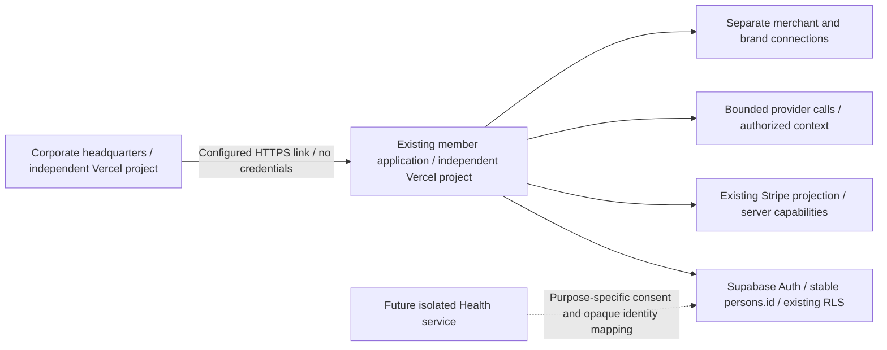

# AETHELIOS — THE HUMAN ASCENDANCE

## Decision and Phase One

Aethelios becomes one company with distinct, connected divisions: Intelligence, Biology, Technology and Experience. Two existing repositories serve different responsibilities. Corporate headquarters is public information and portfolio discovery. Public Aethelios remains the only subscription software platform; its historical repository name, database IDs and technical compatibility names remain.

No new database, provider migration, customer record copy, billing product or competing app is introduced. Health education has no persistence or provider call. General appointment reminders live in React state and vanish on reload. Corporate inquiries are browser-created downloads or a verified mailto, not submitted records.

## Product structure and compatibility

Talk, Work and Studio remain the primary destinations. Ecosystem is a fourth discovery destination, with links into existing routes. `/app/ecosystem`, `/app/entities`, `/app/life` and `/app/health` are additive. Legacy `/app/world` remains available and links into the new directory. Entity role IDs, Council receipts, subscriptions, access policies and API names do not change. Entity links prepare generic drafts, never send or activate a cast automatically.

The Ascendance Brief should build on the existing dated Command/next-move projection, not a second summary store. First add source-linked goal/project/commitment projections only where authorized; disclose missing sources and last refresh. Keep deterministic preparation separate from provider synthesis. Refresh derived views on source changes and require review for writes. No calendar is connected in this phase.

The Living Profile is the existing `persons` + Ascend baseline + confirmed memory foundation, with distinct sources and existing correction/forget controls. A later unified inspection/export/deletion screen should compose these records, not collapse them into untyped global memory. Conversation removal, memory removal, provider retention and backup retention are separate operations.

The Entity Network starts with existing Council: reviewed cast, bounded perspectives, synthesis and stored receipt. Future handoffs must receive an explicit minimal envelope (purpose, recipients, selected source IDs, expiry, consent and permitted actions). Revalidate ownership at execution. Treat documents, prompts and prior model output as untrusted data. Do not pass entire conversations by default. Separate external action approvals from project/mission records. No Agents SDK replacement is necessary now.

## Portable identity without account recreation

`persons.id` is already a distinct stable UUID. Preserve its values and all `person_id` relationships. `persons.auth_user_id` currently maps to unique Supabase Auth IDs and RLS derives ownership through that relationship. Stripe customer/subscription projections continue to bind to the same person.

Future expansion can add a narrowly controlled provider identity mapping `(issuer, subject) -> existing persons.id`, with unique issuer/subject, verified binding and an operator-reviewed backfill. Do not change current RLS or authenticate on a client-provided person ID. Storage UID prefixes require a separate verified mapping strategy if provider identity changes. Never match accounts by unverified email or trust user metadata for authorization.

Supabase's documented OAuth 2.1/OIDC server supports authorization-code PKCE, discovery/JWKS and client-aware policies. A future separate app can use registered clients, exact redirect URIs, state/nonce, PKCE, token validation, purpose-scoped audiences and explicit consent. Avoid parent-domain cookies and bearer tokens in URLs. Corporate headquarters needs no login. SSO is proposed, not implemented; no second identity service is required for informational pages.

## Health boundary

The introductory experience is educational and available without a clinical entitlement. It grants no new capability. Biological Identity, biomarker ingestion, wearable timelines and clinician connectivity are planned, not functional controls.

Before sensitive storage: identify legal roles/jurisdictions; document data flow, purpose and consent; minimize processing; approve encryption/access/audit/retention/export/deletion/recovery/incident controls; assess consumer-health laws even when HIPAA does not apply. Clinical PHI needs BAAs and configured compliant services across hosting, database, model, telemetry and partners. A paid plan or SOC 2 badge alone does not establish compliance.

Use a separate purpose-specific Health boundary with a scoped service API, isolated storage and opaque member references. General memory, Entity calls, Shopify, product analytics and company rooms receive no raw health records. Future clinical authorization is independent of membership. FHIR offers structured exchange resources, not permission, identity matching or clinical correctness; select partner-supported versions and profiles before implementing an adapter. Do not create a speculative FHIR database today.

## Hosting and integrations

Retain separate Vercel projects for each repository and the current Supabase platform. Proposed `aethelios.com` and `app.aethelios.com` remain unverified. `AETHELIOS_APP_ORIGIN` (corporate) and `AETHELIOS_CORPORATE_ORIGIN` (both) accept explicitly configured HTTPS origins only. No secrets, member IDs, tokens or draft text are appended to cross-site links. Unconfigured corporate app entrance shows a truthful internal introduction. No shared customer database or global commerce session is created.

Use environment-scoped secrets, protected previews and separate non-production data. Future API communications need server-validated tokens/audiences, purpose restrictions and idempotent commands. Add durable queues or specialized compute only when a validated long-running task requires them; Vercel request lifetime is not a background-job guarantee. Track costs by request/task/model/person capability using non-content metadata. Health requires separate observability redaction and access policies.

## Commercial continuity and unit economics

Preserve existing Essential $19.99, Signature $49.99 and Reserve $74.99 monthly USD definitions, legacy tiers, Stripe IDs and paid-invoice entitlement rules. No existing commercial promise is silently rewritten. Source offer definitions do not prove activated subscriptions or actual usage. Founder/operator must review live product commitments and non-content billing/usage aggregates before revisions.

Use a cost worksheet rather than guessed current provider prices:

`monthly contribution = price - payment costs - inference - image generation - document processing - storage/egress - automation - support allocation`.

`text cost = input_tokens * input_rate / 1e6 + output_tokens * output_rate / 1e6 + tool charges`; include title/summary calls, cached-token pricing where applicable, failed billed requests and Council fanout/synthesis. Image/edit costs depend on model, resolution, quality and reference inputs. Existing 12/day image reservations are technical caps, not a sustainable included allowance.

Illustrative budget assumptions ONLY: reserve 20% of gross price for compute, leaving $4.00 / $10.00 / $15.00 monthly. At assumed $0.10 per image and $0.02 per complete conversation task, 20 images + 100 tasks consume $4.00 before documents/storage/automation. At $0.50 per image, the same images consume $10.00. These are sensitivity scenarios, not verified provider rates or promised allowances. Current pricing pages were blocked during research; approve no numerical allocation from these assumptions.

Proposed sequence: retain free identity and basic Life; preserve current paid access; meter advanced Entity/Studio/Build operations; evaluate optional add-ons with explicit allowances and spend ceilings. Health education is not clinical eligibility. Never promise unlimited expensive work, activate new prices or charge customers during this phase.

## Research actually consulted — 2026-10-10

- Installed Next.js 16.3.5 docs: layouts/pages, multi-zones and framework metadata. Separate deployments require normal full navigation; multi-zones are unnecessary for this boundary.
- [Supabase OAuth server official source](https://github.com/supabase/supabase/blob/master/apps/docs/content/guides/auth/oauth-server.mdx): PKCE/OIDC, client IDs and existing RLS applicability.
- [Supabase RLS official source](https://github.com/supabase/supabase/blob/master/apps/docs/content/guides/database/postgres/row-level-security.mdx): grants and row policies both matter.
- [Supabase HIPAA official source](https://github.com/supabase/supabase/blob/master/apps/docs/content/guides/security/hipaa-compliance.mdx): BAA, project configuration and continuing customer responsibility.
- [OpenAI Agents handoffs](https://github.com/openai/openai-agents-python/blob/main/docs/handoffs.md): default history transfer, explicit filters, provider recipient boundaries and server-managed-history limitations.
- [HL7 FHIR overview source](https://github.com/HL7/fhir/blob/master/source/overview.html): resource-based healthcare exchange and references.
- [Anthropic workflow cookbook](https://github.com/anthropics/anthropic-cookbook/tree/main/patterns/agents): competitive pattern of composable routing/evaluation before autonomous infrastructure; not copied UI.

Direct Next, Vercel, Supabase, OpenAI pricing, ChatGPT Projects and W3C pages were blocked by the network proxy. Authoritative GitHub sources were used where available; installed Next docs and existing Vercel configuration support the implementation. No fresh pricing verification, competitor UX benchmark, Vercel infrastructure audit or compliance certification is claimed.

## Next phases and founder decisions

1. Validate the existing paid-member journey against synthetic staging users, retain commercial commitments and measure task costs. Resolve inherited release gates before promotion.
2. Improve Personal Intelligence continuity and a source-linked Ascendance Brief; compose existing records with clear consent and freshness.
3. Unify Living Profile inspection/export/deletion and Entity context envelopes; avoid automatic memory promotion.
4. Develop Health literacy and the Atlas; approve purpose/privacy architecture before biomarker storage or wearable connection.
5. Meter Studio and scoped Build work; sandbox execution needs an independent threat model, approval system and budget.
6. Add OIDC federation only when a second authenticated app needs it; preserve stable member IDs and subscriptions.
7. Verify independent portfolio destinations, appointments and commerce benefits without merging business data.

Founder approvals next: exact master crest, verified domains and company inbox, publication/production promotion after review, commercial commitments and allowance budgets, and any future sensitive-data/clinical scope. No DNS, billing activation, database migration or deployment occurred here.
